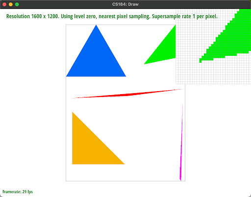
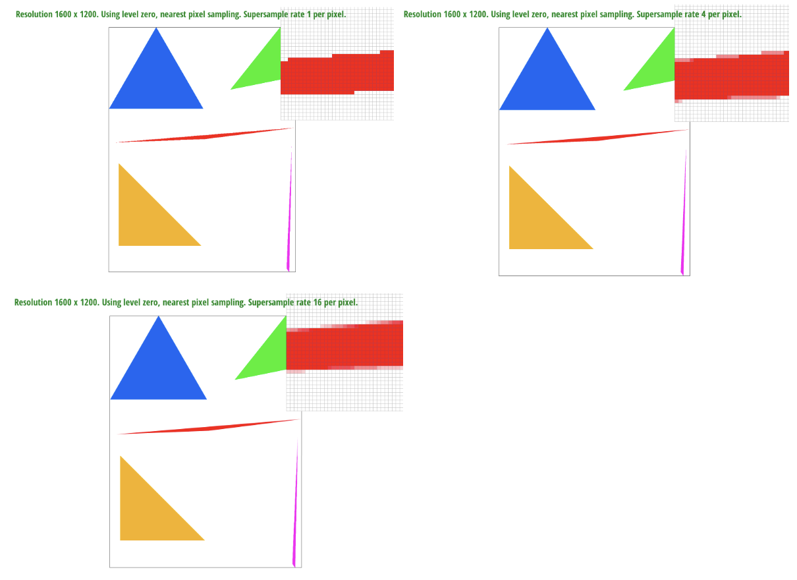
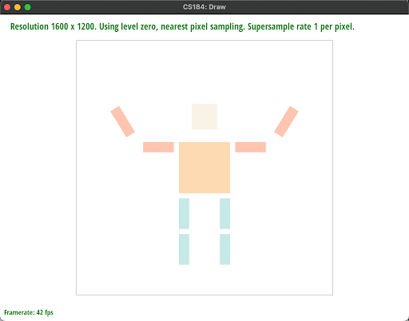
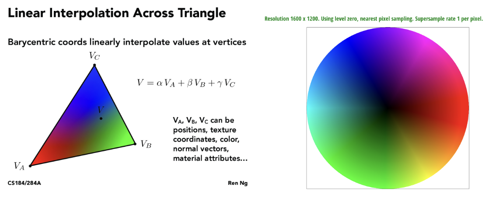
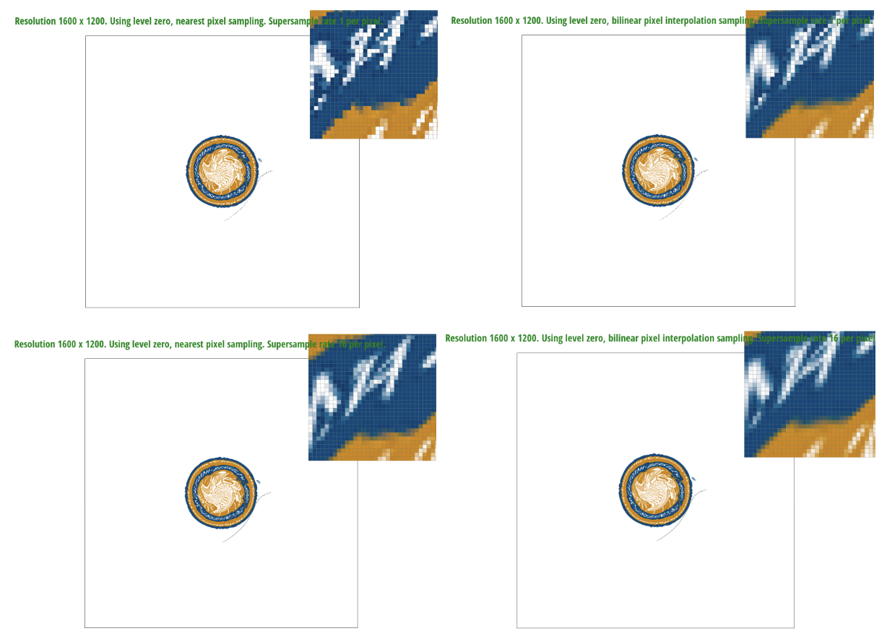
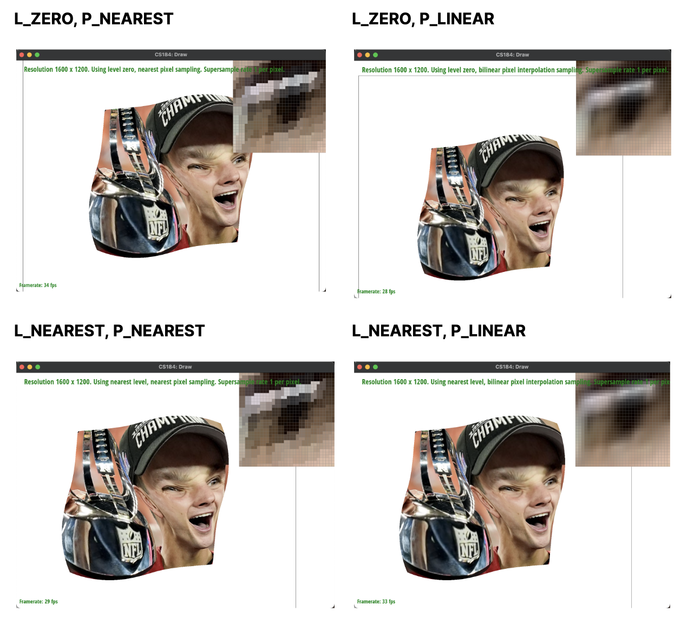
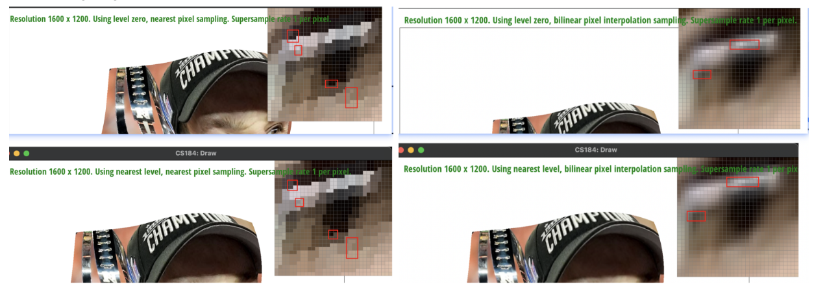

# Homework 1 

## Task 1
We rasterize triangles by 
computing the highest and lowest x and y values of the triangle’s coordinates to find the bounding box of the triangle
Checking every coordinate to see if it lies inside the triangle or not by using the given `inside()` function, which uses the point in triangle three line tests 
Since the ordering of the points matters in this function, we altered the function to return true if three line results are all positive or all negative.
Filling in nearest pixel with the given color if the coordinate is inside the triangle

This algorithm is no worse than one that checks each sample within the bounding box of the triangle, because it does exactly that - it checks all coordinates in the bounding box.

## Task 2
Our supersampling algorithm starts by scaling the size of the sample_buffer by the sample_rate in `set_sample_rate()` and `set_frambuffer_target()`. After that, we reduce the `stepSize` we traverse the triangle with according to the square root of the sample rate, since each side of the grid is scaled by `sqrt(sample_rate)`. Finally, we ensure that we scale the coordinate back to a correct index for the `sample_buffer`, and then we downsample the `sample_buffer` into the `frame_buffer` in the `resolve_to_framebuffer()` function. Modifications made in the rasterization were just to increase the grid size and update indices accordingly.

Supersampling is useful because it reduces aliasing by computing pixel colors based on more pixels with a smaller stepSize and downsampling them for an overall average color. Benefits of reducing aliasing are providing more precise colors, borders, and gradients. We used supersampling to antialias by reducing the sharpness of the triangle’s borders. As you can see from the images below, as the supersample rate grows from 1 to 16, the edges of the red triangle become less sharp and more pixels of lighter shades of red are present.

## Task 3
Cubeman is happy he has finished his 184 homework; his arms are raised up in celebration. Yay! He feasted on McDonalds chicken nuggets and hamburgers as fuel, so his belly is orange. Cubeman is a fan of pastel colors and wears cute pastel clothes.

## Task 4
Barycentric coordinates can represent a location through scalar multiples of a triangle’s points. For example in the image, the old coordinate can be represented as a weight average of the point vectors using the barycentric coordinates of alpha, beta, and gamma.

## Task 5
Pixel sampling techniques are those that sample a pixel based on some metric, such as the nearest neighbor or interpolation (linear, bilinear, trilinear, etc.). Nearest neighbor just chooses the closest discrete point by rounding the coordinate, and bilinear interpolation uses the ratio of the distance between adjacent points to scale how much each adjacent pixel contributes to the final color. In this homework, we implemented it to sample the corresponding pixel in the texture map based on the original coordinate. 

The main difference between nearest and bilinear in this image is that the logo’s lines are more blurred in bilinear, which reduces aliasing and makes it cleaner and less jaggedy to the viewer. The difference between the two techniques becomes large with images with high frequencies, or images with a lot of small lines, since those images tend to have a lot of aliasing.

## Task 6
Level sampling is essentially the technique of sampling from adjacent levels in a downsampled pyramid. This allows us to sample an average color from a broader number of pixels, adding a third dimension to the sampling techniques, which is the grid size of pixels in the whole image. We implemented it by using the coordinate differentials to compute the mipmap level, and then applying the nearest and bilinear techniques to the values returned from adjacent mipmap levels.

|  | speed | memory usage | antialiasing power |
| --- | ------- | ------- | ------- |
| **pixel sampling** | This is likely the fastest of the three since this technique samples the least amount per pixel. | Since we are sampling a pixel/a few at a time, less memory is required. | This likely has the least antialiasing power. Because we are taking less samples per pixel, there will be more artifacts.
| **level sampling** | This is likely one of the slowest of the three because many samples are taken from across the grid inorder to compute the mipmap and average color. | This technique requires more memory due to the computation from averaging a broader number of pixels. This probably requires the most computation of the three. | This will lead to more antialiasing because we are taking many samples per pixel, and blending them together.
| **number of samples per pixel** | The speed is dependent on the number of samples we take. The less samples per pixel, the faster the computations and vice versa for more. | The more samples we want, the higher the memory usage since we need to keep all values in memory. We need to find the optimal balance between quality and the tradeoff of memory/speed. | The more samples we take, the more antialiasing there is and the better the result as reflected by smoother edges and less artifacts.

\
*Level sampling & pixel sampling on Purdy*

*A few highlighted differences:*

